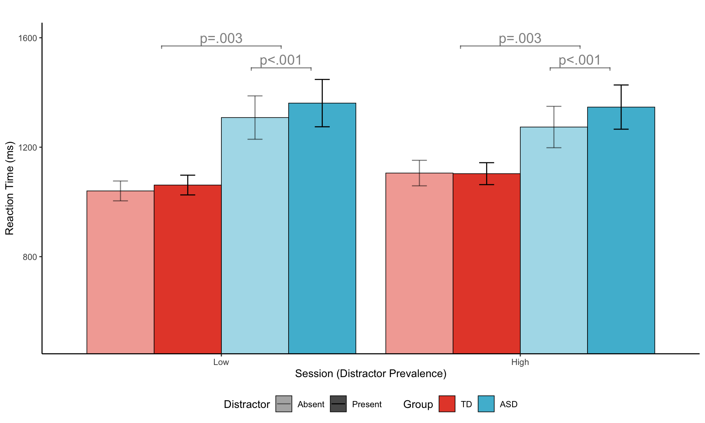
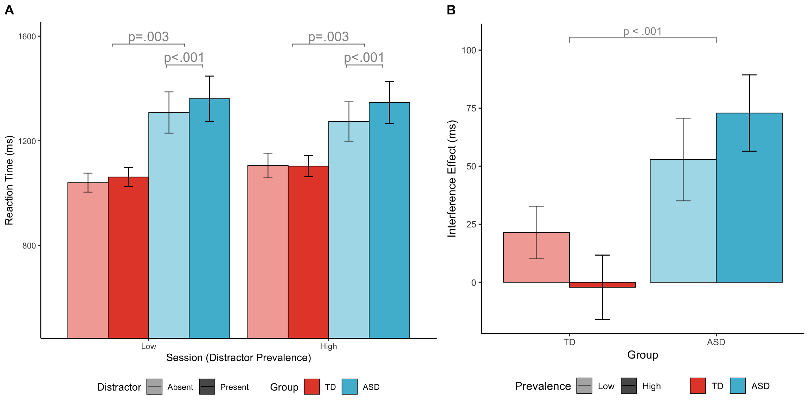
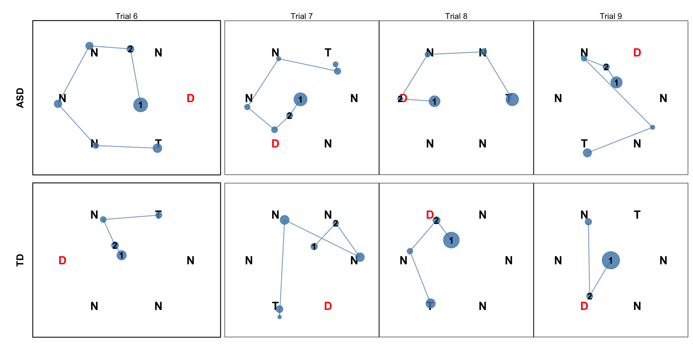
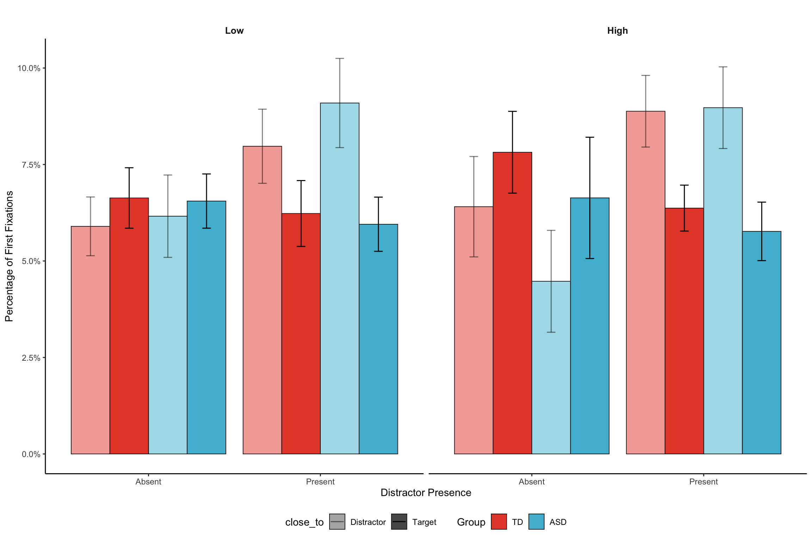
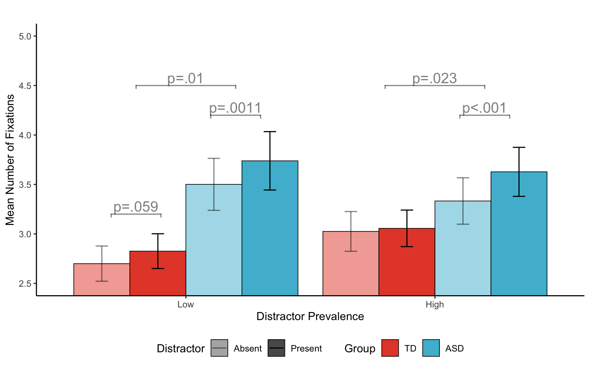
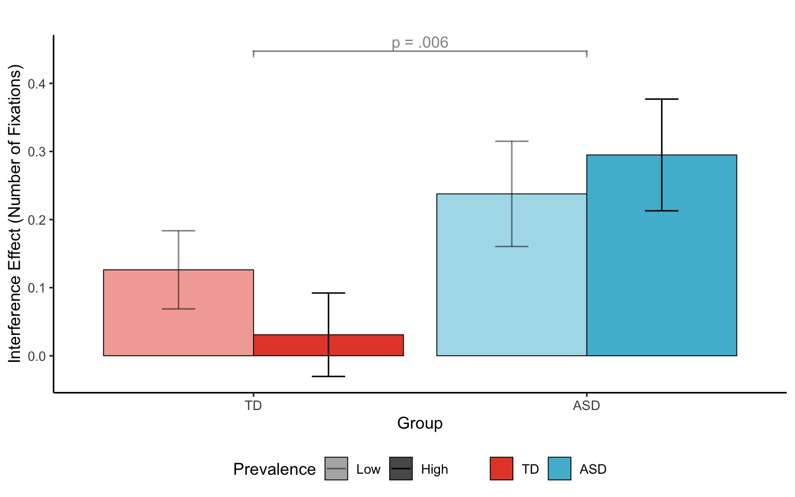
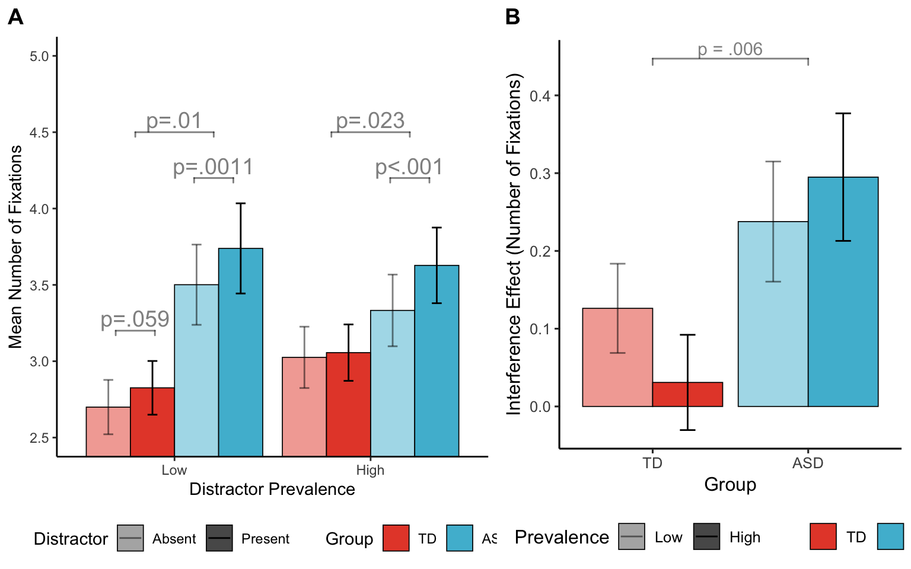
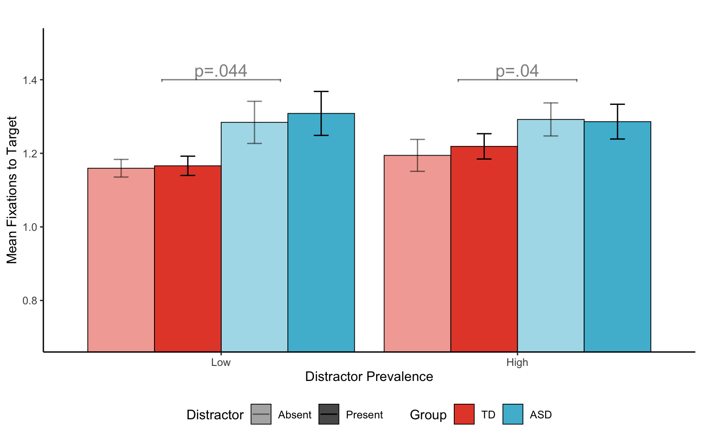
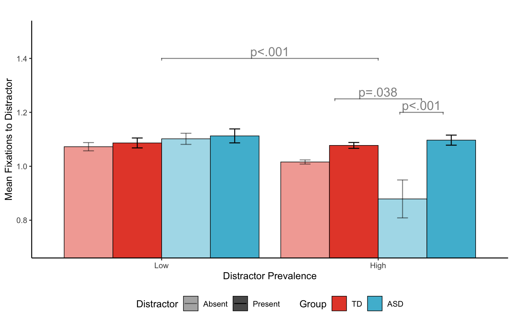
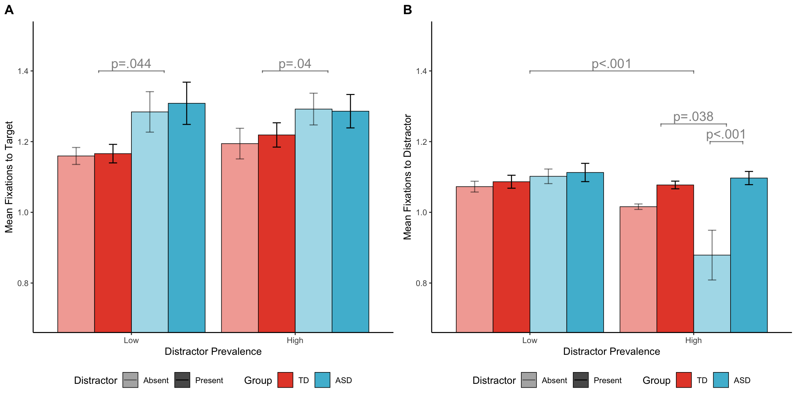

<script src="data_ana_files/libs/kePrint-0.0.1/kePrint.js"></script>
<link href="data_ana_files/libs/lightable-0.0.1/lightable.css" rel="stylesheet" />


# Abstract

This analysis examines distractor suppression mechanisms in autism spectrum disorder (ASD) compared to typically developing (TD) individuals using an additional singleton search task with precueing. We investigate reaction time patterns, eye movement behavior, and attentional deployment strategies across different distractor prevalence conditions.

# Introduction

The ability to suppress irrelevant visual information is crucial for efficient visual search. Previous research suggests that individuals with ASD may show altered patterns of attentional control and distractor suppression. This study examines these mechanisms using behavioral and eye movement measures in a precued visual search task.

# Methods

## Participants and Designf

The study included participants from two groups: - **ASD group**: Individuals diagnosed with autism spectrum disorder - **TD group**: Typically developing control participants

## Task and Procedure

Participants performed an additional singleton search task with the following manipulations: - **Singleton prevalence**: Low (50%) vs. High (90%) singleton frequency - **Singleton presence**: Singleton present vs. absent trials - **Precueing**: 100% valid spatial cues indicating potential singleton locations

## Data Analysis

All analyses were conducted using mixed-effects models with participants as random effects. Effect sizes are reported as partial eta-squared (η²p) for ANOVAs and Cohen's d for t-tests.

# Results

## Data Loading and Preprocessing

``` r
# Load behavioral and eye movement data
behav <- read_csv(file.path(data_dir, 'behav.csv'), show_col_types = FALSE)
fix_with_behav <- read_csv(file.path(data_dir, 'fix_with_behav.csv'), show_col_types = FALSE)

# Data preprocessing
behav <- behav %>%
  mutate(
    group = factor(group, levels = c("TD", "ASD")),
    distractor_prevalence = factor(distractor_prevalence,
                                 levels = c(0.5, 0.9),
                                 labels = c("Low", "High")),
    singleton = factor(singleton,
                      levels = c(0, 1),
                      labels = c("Absent", "Present"))
  )

fix_with_behav <- fix_with_behav %>%
  mutate(
    group = factor(group, levels = c("TD", "ASD")),
    distractor_prevalence = factor(distractor_prevalence,
                                 levels = c(0.5, 0.9),
                                 labels = c("Low", "High")),
    close_to = factor(close_to)
  )

# Display data summary
cat("Behavioral data dimensions:", dim(behav), "\n")
```

    Behavioral data dimensions: 23600 16 

``` r
cat("Eye movement data dimensions:", dim(fix_with_behav), "\n")
```

    Eye movement data dimensions: 98635 23 

``` r
cat("Participants per group:\n")
```

    Participants per group:

``` r
table(behav$group, behav$subj) %>%
  apply(1, function(x) sum(x > 0)) %>%
  print()
```

     TD ASD 
     31  28 

## Reaction Time Analysis

### Data Preparation

``` r
# Calculate mean RTs for correct trials, excluding outliers
mRTs <- behav %>%
  filter(corr == 1, outlier == FALSE) %>%
  group_by(group, subj, distractor_prevalence, singleton) %>%
  summarise(RT = mean(rt, na.rm = TRUE) * 1000, .groups = 'drop') %>%
  rename(Group = group,
         Subj = subj,
         Prevalence = distractor_prevalence,
         Singleton = singleton)

# Display summary statistics
mRTs %>%
  group_by(Group, Prevalence, Singleton) %>%
  summarise(
    N = n(),
    Mean_RT = round(mean(RT), 1),
    SD_RT = round(sd(RT), 1),
    SE_RT = round(sd(RT)/sqrt(n()), 1),
    .groups = 'drop'
  ) %>%
  kable(caption = "Mean reaction times (ms) by experimental condition") %>%
  kable_styling(bootstrap_options = c("striped", "hover"))
```

| Group | Prevalence | Singleton |   N | Mean_RT | SD_RT | SE_RT |
|:------|:-----------|:----------|----:|--------:|------:|------:|
| TD    | Low        | Absent    |  31 |  1040.2 | 201.8 |  36.2 |
| TD    | Low        | Present   |  31 |  1061.7 | 200.9 |  36.1 |
| TD    | High       | Absent    |  31 |  1105.5 | 259.4 |  46.6 |
| TD    | High       | Present   |  31 |  1103.3 | 223.4 |  40.1 |
| ASD   | Low        | Absent    |  28 |  1308.3 | 419.5 |  79.3 |
| ASD   | Low        | Present   |  28 |  1361.2 | 457.7 |  86.5 |
| ASD   | High       | Absent    |  28 |  1273.7 | 400.0 |  75.6 |
| ASD   | High       | Present   |  28 |  1346.6 | 427.6 |  80.8 |

Mean reaction times (ms) by experimental condition

### Statistical Analysis

``` r
# Repeated measures ANOVA using aov_ez
rt_aov <- aov_ez(id = "Subj",
                 dv = "RT",
                 data = mRTs,
                 within = c("Prevalence", "Singleton"),
                 between = "Group",
                 type = 3)

# ANOVA table
create_anova_table(rt_aov, "Repeated measures ANOVA for reaction time analysis")
```

| Effect | df | MSE | F | ηp² \[95% CI\] | ges | p.value |
|:---|:---|:---|:---|:---|:---|:---|
| Group | 1, 57 | 353698.93 | 9.97 \*\* | 0.149 \[0.035, 1.000\] | .121 | .003 |
| Prevalence | 1, 57 | 89208.03 | 0.14 | 0.002 \[0.000, 1.000\] | \<.001 | .712 |
| Group:Prevalence | 1, 57 | 89208.03 | 1.00 | 0.017 \[0.000, 1.000\] | .003 | .321 |
| Singleton | 1, 57 | 3007.99 | 25.72 \*\*\* | 0.311 \[0.155, 1.000\] | .003 | \<.001 |
| Group:Singleton | 1, 57 | 3007.99 | 13.86 \*\*\* | 0.196 \[0.064, 1.000\] | .002 | \<.001 |
| Prevalence:Singleton | 1, 57 | 3478.80 | 0.01 | 0.000 \[0.000, 1.000\] | \<.001 | .907 |
| Group:Prevalence:Singleton | 1, 57 | 3478.80 | 2.01 | 0.034 \[0.000, 1.000\] | \<.001 | .162 |

Repeated measures ANOVA for reaction time analysis

The mixed ANOVA revealed a significant main effect of Group, and singleton, but not Prevalence. There was a significant interaction between Group and singleton. The rest interactions were non-significant.

Based on mRTs table above, the ASD group showed generally slower RTs, and both groups exhibited the expected singleton effect (slower RTs when distractor present). The interaction was mainly driven by a larger distractor capture effect in the ASD group, but not in the TD group (see below post-hoc tests).

    Post-hoc tests: Group differences within each Singleton condition

| contrast         | Group | estimate |     SE |  df | t.ratio | p.value |
|:-----------------|:------|---------:|-------:|----:|--------:|--------:|
| Absent - Present | TD    |   -9.643 |  9.850 |  57 |  -0.979 |   0.332 |
| Absent - Present | ASD   |  -62.878 | 10.365 |  57 |  -6.067 |   0.000 |

Group differences within Singleton conditions

The above post-hoc tests indicated that the presence of a distractor singleton significantly slowed RTs in the ASD group (p \< .001), but not in the TD group (p = .332), suggesting that TD individuals effectively suppressed the distractor with perfect cue validity, but not with individuals with ASD.

### Visualization

<figure>

<figcaption aria-hidden="true">Mean reaction times across experimental conditions. Error bars represent standard errors. Brackets with *** indicate significant singleton effect within ASD group (p &lt; .001). ** at top indicates significant group difference (p &lt; .01).</figcaption>
</figure>

## Distractor Interference Analysis

To better show the group differences in distractor suppression, we calculated the distractor interference effect (RT difference between distractor present and absent trials) for each participant in each prevalence condition.

### Interference Effect Calculation

``` r
# Calculate distractor interference (Present - Absent)
mRTs_wide <- mRTs %>%
  pivot_wider(names_from = Singleton, values_from = RT) %>%
  mutate(interference = Present - Absent) %>%
  filter(!is.na(interference))

# Summary statistics for interference
mRTs_wide %>%
  group_by(Group, Prevalence) %>%
  summarise(
    N = n(),
    Mean_Interference = round(mean(interference), 1),
    SD_Interference = round(sd(interference), 1),
    SE_Interference = round(sd(interference)/sqrt(n()), 1),
    .groups = 'drop'
  ) %>%
  kable(caption = "Distractor interference effects (ms) by group and prevalence") %>%
  kable_styling(bootstrap_options = c("striped", "hover"))
```

| Group | Prevalence |   N | Mean_Interference | SD_Interference | SE_Interference |
|:------|:-----------|----:|------------------:|----------------:|----------------:|
| TD    | Low        |  31 |              21.4 |            62.6 |            11.2 |
| TD    | High       |  31 |              -2.2 |            77.2 |            13.9 |
| ASD   | Low        |  28 |              52.9 |            94.0 |            17.8 |
| ASD   | High       |  28 |              72.9 |            87.0 |            16.4 |

Distractor interference effects (ms) by group and prevalence

### Statistical Analysis of Interference

``` r
# Repeated measures ANOVA for interference effect using aov_ez
interference_aov <- aov_ez(id = "Subj",
                          dv = "interference",
                          data = mRTs_wide,
                          within = "Prevalence",
                          between = "Group",
                          type = 3)

create_anova_table(interference_aov, "Repeated measures ANOVA for distractor interference")
```

| Effect | df | MSE | F | ηp² \[95% CI\] | ges | p.value |
|:---|:---|:---|:---|:---|:---|:---|
| Group | 1, 57 | 6015.98 | 13.86 \*\*\* | 0.196 \[0.064, 1.000\] | .101 | \<.001 |
| Prevalence | 1, 57 | 6957.60 | 0.01 | 0.000 \[0.000, 1.000\] | \<.001 | .907 |
| Group:Prevalence | 1, 57 | 6957.60 | 2.01 | 0.034 \[0.000, 1.000\] | .019 | .162 |

Repeated measures ANOVA for distractor interference

``` r
# Post-hoc tests for Group differences
interference_emm <- emmeans(interference_aov, ~ Group)
interference_contrasts <- pairs(interference_emm, adjust = "bonferroni")

cat("Post-hoc tests: Group differences in interference\n")
```

    Post-hoc tests: Group differences in interference

``` r
create_posthoc_table(interference_contrasts, "Group differences in interference effects")
```

| contrast | estimate |     SE |  df | t.ratio | p.value |
|:---------|---------:|-------:|----:|--------:|--------:|
| TD - ASD |  -53.235 | 14.299 |  57 |  -3.723 |       0 |

Group differences in interference effects

    One-sample t-test for TD group interference:

    t = 1.07 , df = 61 , p = 0.287 

    95% CI: [ -8.32 ,  27.61 ]

    Cohen's d = 0.14 , 95% CI: [ -0.11 ,  0.39 ]

The above test confirmed that the TD did not show significant distractor interference, but the ASD group did.

### Interference Visualization

### Combined Figure: RT and Interference

<figure>

<figcaption aria-hidden="true">Reaction time and distractor interference effects. (A) Mean reaction times across conditions. (B) Distractor interference effects by group and prevalence. Error bars represent standard errors.</figcaption>
</figure>

## Eye Movement Analysis

Motivation: While manual responses (RTs) clearly showed more substantial distractor interference in the ASD group than the TD group, the timeline of attentional processing in which this occurred remained unclear. The pattern of eye movements across the whole search trial, from display onset to response, might. To better understand distractor interference, we further looked into several metrics derived from eye movement data.

### Example Fixation Patterns

To illustrate the differences in eye movement behavior between groups, we first show example fixation sequences for individual trials from representative participants.

<figure>

<figcaption aria-hidden="true">Example fixation patterns for individual trials. Top row: ASD participant, bottom row: TD participant. Each panel shows one trial with fixation sequence (connected dots), fixation numbers, target locations (squares), and distractor locations (triangles). Colors indicate whether fixations landed on target (red), distractor (blue), or other locations (gray).</figcaption>
</figure>

The example trials illustrate typical differences between groups: ASD participants often show more fixations to distractor locations and longer fixation sequences, while TD participants demonstrate more efficient search patterns with fewer distractors fixations when distractors are present.

### First Fixation Analysis

``` r
# Calculate actual total trials per condition (using fixationNo == 1 as it exists for every trial)
actual_total_trials <- fix_with_behav %>%
  filter(fixationNo == 1) %>%
  group_by(subj, distractor_prevalence, singleton, group) %>%
  summarise(total_trials = n(), .groups = 'drop')

# Analyze first fixation after central fixation (fixationNo == 2)
close_to_counts <- fix_with_behav %>%
  filter(fixationNo == 2) %>%
  group_by(subj, distractor_prevalence, singleton, group, close_to) %>%
  summarise(n_trials = n(), .groups = 'drop')

# Complete missing combinations with 0 first (before calculating percentages)
# Get all subjects and all possible condition combinations
all_subjects <- close_to_counts %>%
  distinct(subj, group)

all_conditions <- close_to_counts %>%
  distinct(distractor_prevalence, singleton, close_to)

# Create complete grid
close_to_summary <- all_subjects %>%
  crossing(all_conditions) %>%
  left_join(close_to_counts, by = c("subj", "group", "distractor_prevalence", "singleton", "close_to")) %>%
  mutate(n_trials = replace_na(n_trials, 0)) %>%
  # Join with actual total trials
  left_join(actual_total_trials, by = c("subj", "group", "distractor_prevalence", "singleton")) %>%
  # Now calculate percentage with correct total_trials
  mutate(percentage = if_else(total_trials > 0, n_trials / total_trials, 0)) %>%
  ungroup()

# Focus on Target and Distractor fixations (exclude "Other")
close_to_dt <- close_to_summary %>%
  filter(close_to != "Other") 


# Summary statistics
close_to_dt %>%
  group_by(group, distractor_prevalence, singleton, close_to) %>%
  summarise(
    N = n(),
    Mean_Percentage = round(mean(percentage), 3),
    SD_Percentage = round(sd(percentage), 3),
    .groups = 'drop'
  ) %>%
  kable(caption = "First fixation landing positions by experimental condition") %>%
  kable_styling(bootstrap_options = c("striped", "hover"))
```

| group | distractor_prevalence | singleton | close_to | N | Mean_Percentage | SD_Percentage |
|:---|:---|:---|:---|---:|---:|---:|
| TD | Low | Absent | Distractor | 31 | 0.059 | 0.042 |
| TD | Low | Absent | Target | 31 | 0.066 | 0.044 |
| TD | Low | Present | Distractor | 31 | 0.080 | 0.053 |
| TD | Low | Present | Target | 31 | 0.062 | 0.048 |
| TD | High | Absent | Distractor | 31 | 0.064 | 0.072 |
| TD | High | Absent | Target | 31 | 0.078 | 0.059 |
| TD | High | Present | Distractor | 31 | 0.089 | 0.052 |
| TD | High | Present | Target | 31 | 0.064 | 0.033 |
| ASD | Low | Absent | Distractor | 28 | 0.062 | 0.056 |
| ASD | Low | Absent | Target | 28 | 0.066 | 0.037 |
| ASD | Low | Present | Distractor | 28 | 0.091 | 0.061 |
| ASD | Low | Present | Target | 28 | 0.060 | 0.037 |
| ASD | High | Absent | Distractor | 28 | 0.045 | 0.070 |
| ASD | High | Absent | Target | 28 | 0.066 | 0.083 |
| ASD | High | Present | Distractor | 28 | 0.090 | 0.056 |
| ASD | High | Present | Target | 28 | 0.058 | 0.040 |

First fixation landing positions by experimental condition

### First Fixation Visualization

<figure>

<figcaption aria-hidden="true">Combined first fixation analysis. Top row: percentage of first fixations to target and distractor locations. Bottom row: first fixation dwell times. Both measures show group differences in attentional deployment patterns.</figcaption>
</figure>

#### Stacked Bar Chart: First Fixation Distribution

<figure>

<figcaption aria-hidden="true">Distribution of first saccadic fixations across all possible landing locations by experimental condition. Each horizontal bar represents one combination of singleton presence (Absent/Present), distractor prevalence (Low/High), and group (TD/ASD), showing the percentage breakdown of first fixations landing on the Target (blue), Distractor (red), or Other locations (gray). Bars sum to approximately 100% within each condition. The stacked format reveals how attentional deployment differs across conditions, with target-directed saccades competing with capture by salient distractors and fixations to non-cued locations.</figcaption>
</figure>

### First Fixation Statistical Analysis

``` r
# Repeated measures ANOVA for first fixation percentages using aov_car
fixation_aov <- aov_ez(id = "subj",
                       dv = "percentage",
                       data = close_to_summary %>% filter(close_to == "Distractor"),
                       within = c("singleton", "distractor_prevalence"),
                       between = "group",
                       type = 3)
#fixation_aov <- aov_car(percentage ~ group * close_to * singleton*distractor_prevalence+ Error(subj/(c#lose_to * singleton*distractor_prevalence)),
##                      type = 3)

create_anova_table(fixation_aov, "Repeated measures ANOVA for first fixation analysis")
```

| Effect | df | MSE | F | ηp² \[95% CI\] | ges | p.value |
|:---|:---|:---|:---|:---|:---|:---|
| group | 1, 57 | 0.01 | 0.01 | 0.000 \[0.000, 1.000\] | \<.001 | .915 |
| singleton | 1, 57 | 0.00 | 37.18 \*\*\* | 0.395 \[0.235, 1.000\] | .063 | \<.001 |
| group:singleton | 1, 57 | 0.00 | 2.15 | 0.036 \[0.000, 1.000\] | .004 | .148 |
| distractor_prevalence | 1, 57 | 0.00 | 0.01 | 0.000 \[0.000, 1.000\] | \<.001 | .908 |
| group:distractor_prevalence | 1, 57 | 0.00 | 0.91 | 0.016 \[0.000, 1.000\] | .005 | .344 |
| singleton:distractor_prevalence | 1, 57 | 0.00 | 0.99 | 0.017 \[0.000, 1.000\] | .002 | .325 |
| group:singleton:distractor_prevalence | 1, 57 | 0.00 | 0.35 | 0.006 \[0.000, 1.000\] | \<.001 | .557 |

Repeated measures ANOVA for first fixation analysis

| Effect | df | MSE | F | ηp² \[95% CI\] | ges | p.value |
|:---|:---|:---|:---|:---|:---|:---|
| group | 1, 57 | 0.01 | 0.31 | 0.005 \[0.000, 1.000\] | .003 | .583 |
| singleton | 1, 57 | 0.00 | 3.05 + | 0.051 \[0.000, 1.000\] | .007 | .086 |
| group:singleton | 1, 57 | 0.00 | 0.04 | 0.001 \[0.000, 1.000\] | \<.001 | .842 |
| distractor_prevalence | 1, 57 | 0.00 | 0.27 | 0.005 \[0.000, 1.000\] | \<.001 | .602 |
| group:distractor_prevalence | 1, 57 | 0.00 | 0.37 | 0.007 \[0.000, 1.000\] | .001 | .543 |
| singleton:distractor_prevalence | 1, 57 | 0.00 | 0.59 | 0.010 \[0.000, 1.000\] | .001 | .445 |
| group:singleton:distractor_prevalence | 1, 57 | 0.00 | 0.21 | 0.004 \[0.000, 1.000\] | \<.001 | .651 |

Repeated measures ANOVA for first fixation analysis (Target)

| contrast         | distractor_prevalence | estimate |    SE |  df | t.ratio | p.value |
|:-----------------|:----------------------|---------:|------:|----:|--------:|--------:|
| Absent - Present | Low                   |   -0.025 | 0.006 |  57 |  -4.484 |       0 |
| Absent - Present | High                  |   -0.035 | 0.008 |  57 |  -4.292 |       0 |

Singleton differences in first fixation patterns between prevalence conditions

    Marginal means for distractor prevalence x singleton interaction:

    distractor_prevalence = Low:
     singleton emmean      SE df lower.CL upper.CL
     Absent    0.0603 0.00646 57   0.0474   0.0732
     Present   0.0853 0.00746 57   0.0704   0.1003

    distractor_prevalence = High:
     singleton emmean      SE df lower.CL upper.CL
     Absent    0.0544 0.00928 57   0.0358   0.0730
     Present   0.0893 0.00701 57   0.0752   0.1033

    Results are averaged over the levels of: group 
    Confidence level used: 0.95 

The interaction between singleton and distractor prevalence was due to lower fixation toward the cued and target locations in the high prevalence condition than in the low prevalence condition in the distractor absent trials, but higher fixation when the distractor was present in the high prevalence condition.

### Number of Fixations Analysis

What happens after the first fixation? We next examined the total number of fixations made during each trial.

``` r
# Calculate number of fixations per trial
max_fixation <- fix_with_behav %>%
  group_by(subj, group, singleton, distractor_prevalence, trialNo) %>%
  summarise(max_fixation = max(fixationNo, na.rm = TRUE), .groups = 'drop') %>%
  mutate(nfixation = max_fixation - 1) %>%
  group_by(subj, group, singleton, distractor_prevalence) %>%
  summarise(mean_nfixation = mean(nfixation, na.rm = TRUE), .groups = 'drop')

# Complete missing combinations (if any) for number of fixations
all_nfix_combinations <- max_fixation %>%
  distinct(subj, group) %>%
  crossing(
    distractor_prevalence = unique(max_fixation$distractor_prevalence),
    singleton = unique(max_fixation$singleton)
  )

max_fixation <- all_nfix_combinations %>%
  left_join(max_fixation, by = c("subj", "group", "distractor_prevalence", "singleton")) %>%
  mutate(mean_nfixation = replace_na(mean_nfixation, 0))

# Statistical analysis using aov_ez
nfix_aov <- aov_ez(id = "subj",
                   dv = "mean_nfixation",
                   data = max_fixation,
                   within = c("singleton","distractor_prevalence"),
                   between = "group",
                   type = 3)

create_anova_table(nfix_aov, "Repeated measures ANOVA for number of fixations")
```

| Effect | df | MSE | F | ηp² \[95% CI\] | ges | p.value |
|:---|:---|:---|:---|:---|:---|:---|
| group | 1, 57 | 4.50 | 5.49 \* | 0.088 \[0.007, 1.000\] | .069 | .023 |
| singleton | 1, 57 | 0.06 | 28.06 \*\*\* | 0.330 \[0.172, 1.000\] | .005 | \<.001 |
| group:singleton | 1, 57 | 0.06 | 8.32 \*\* | 0.127 \[0.023, 1.000\] | .002 | .006 |
| distractor_prevalence | 1, 57 | 1.21 | 0.23 | 0.004 \[0.000, 1.000\] | \<.001 | .631 |
| group:distractor_prevalence | 1, 57 | 1.21 | 2.12 | 0.036 \[0.000, 1.000\] | .008 | .150 |
| singleton:distractor_prevalence | 1, 57 | 0.08 | 0.07 | 0.001 \[0.000, 1.000\] | \<.001 | .796 |
| group:singleton:distractor_prevalence | 1, 57 | 0.08 | 1.08 | 0.019 \[0.000, 1.000\] | \<.001 | .303 |

Repeated measures ANOVA for number of fixations

The ANOVA revealed significant main effects of group and singleton, but not distractor prevalence. The interaction between group and singleton was also significant. The rest was non-significant. There was no significant difference between prevalence conditions, which is consistent with the RT results.

    Post-hoc tests: Group differences in number of fixations by singleton condition

| contrast | distractor_prevalence | estimate |    SE |  df | t.ratio | p.value |
|:---------|:----------------------|---------:|------:|----:|--------:|--------:|
| TD - ASD | Low                   |   -0.857 | 0.321 |  57 |  -2.673 |   0.010 |
| TD - ASD | High                  |   -0.439 | 0.302 |  57 |  -1.455 |   0.151 |

Group differences in number of fixations

The interaction was due to increased number of fixation in the ASD group when the distractor was present, but not in the TD group. This suggests that the presence of a distractor led to less efficient search patterns in the ASD group, resulting in more fixations to locate the target.

### Number of Fixations Visualization

<figure>

<figcaption aria-hidden="true">Mean number of fixations per trial. The ASD group makes more fixations overall, particularly when distractors are present, indicating less efficient search strategies.</figcaption>
</figure>

### Number of Fixations Interference Analysis

Similar to RT interference, we calculated the distractor interference effect for number of fixations (Present - Absent) to better visualize group differences in attentional efficiency.

``` r
# Calculate distractor interference for number of fixations (Present - Absent)
nfix_wide <- max_fixation %>%
  pivot_wider(names_from = singleton, values_from = mean_nfixation) %>%
  mutate(interference = Present - Absent) %>%
  filter(!is.na(interference))

# Summary statistics for number of fixations interference
nfix_wide %>%
  group_by(group, distractor_prevalence) %>%
  summarise(
    N = n(),
    Mean_Interference = round(mean(interference), 3),
    SD_Interference = round(sd(interference), 3),
    SE_Interference = round(sd(interference)/sqrt(n()), 3),
    .groups = 'drop'
  ) %>%
  kable(caption = "Distractor interference in number of fixations by group and prevalence") %>%
  kable_styling(bootstrap_options = c("striped", "hover"))
```

| group | distractor_prevalence | N | Mean_Interference | SD_Interference | SE_Interference |
|:---|:---|---:|---:|---:|---:|
| TD | Low | 31 | 0.126 | 0.319 | 0.057 |
| TD | High | 31 | 0.031 | 0.341 | 0.061 |
| ASD | Low | 28 | 0.238 | 0.409 | 0.077 |
| ASD | High | 28 | 0.295 | 0.434 | 0.082 |

Distractor interference in number of fixations by group and prevalence

``` r
# Repeated measures ANOVA for number of fixations interference
nfix_interference_aov <- aov_ez(id = "subj",
                                dv = "interference",
                                data = nfix_wide,
                                within = "distractor_prevalence",
                                between = "group",
                                type = 3)

create_anova_table(nfix_interference_aov, "Repeated measures ANOVA for number of fixations interference")
```

| Effect | df | MSE | F | ηp² \[95% CI\] | ges | p.value |
|:---|:---|:---|:---|:---|:---|:---|
| group | 1, 57 | 0.12 | 8.32 \*\* | 0.127 \[0.023, 1.000\] | .060 | .006 |
| distractor_prevalence | 1, 57 | 0.16 | 0.07 | 0.001 \[0.000, 1.000\] | \<.001 | .796 |
| group:distractor_prevalence | 1, 57 | 0.16 | 1.08 | 0.019 \[0.000, 1.000\] | .010 | .303 |

Repeated measures ANOVA for number of fixations interference

``` r
# Post-hoc tests for Group differences
nfix_interference_emm <- emmeans(nfix_interference_aov, ~ group)
nfix_interference_contrasts <- pairs(nfix_interference_emm, adjust = "bonferroni")

cat("Post-hoc tests: Group differences in number of fixations interference\n")
```

    Post-hoc tests: Group differences in number of fixations interference

``` r
create_posthoc_table(nfix_interference_contrasts, "Group differences in number of fixations interference")
```

| contrast | estimate |    SE |  df | t.ratio | p.value |
|:---------|---------:|------:|----:|--------:|--------:|
| TD - ASD |   -0.188 | 0.065 |  57 |  -2.884 |   0.006 |

Group differences in number of fixations interference

``` r
# One-sample t-tests for each group x prevalence condition
cat("One-sample t-tests: Testing if interference differs from zero\n\n")
```

    One-sample t-tests: Testing if interference differs from zero

``` r
# Get unique combinations
conditions <- nfix_wide %>%
  distinct(group, distractor_prevalence)

# Perform t-tests for each condition
ttest_results <- data.frame()
for (i in 1:nrow(conditions)) {
  grp <- conditions$group[i]
  prev <- conditions$distractor_prevalence[i]

  # Filter data for this condition
  data_subset <- nfix_wide %>%
    filter(group == grp, distractor_prevalence == prev)

  # Perform t-test
  t_result <- t.test(data_subset$interference, mu = 0)
  d_result <- cohens_d(data_subset$interference, mu = 0)

  # Store results
  ttest_results <- rbind(ttest_results, data.frame(
    group = grp,
    distractor_prevalence = prev,
    n = nrow(data_subset),
    mean_interference = mean(data_subset$interference),
    sd_interference = sd(data_subset$interference),
    t_statistic = as.numeric(t_result$statistic),
    df = as.numeric(t_result$parameter),
    p_value = t_result$p.value,
    ci_lower = t_result$conf.int[1],
    ci_upper = t_result$conf.int[2],
    cohens_d = as.numeric(d_result$Cohens_d),
    d_ci_lower = d_result$CI_low,
    d_ci_upper = d_result$CI_high
  ))
}

# Display results
ttest_results %>%
  mutate(
    t_statistic = round(t_statistic, 3),
    p_value = round(p_value, 4),
    ci_lower = round(ci_lower, 3),
    ci_upper = round(ci_upper, 3),
    mean_interference = round(mean_interference, 3),
    sd_interference = round(sd_interference, 3),
    cohens_d = round(cohens_d, 3),
    d_ci_lower = round(d_ci_lower, 3),
    d_ci_upper = round(d_ci_upper, 3)
  ) %>%
  kable(caption = "One-sample t-tests for number of fixations interference (H0: interference = 0)",
        col.names = c("Group", "Prevalence", "N", "Mean", "SD", "t", "df", "p",
                      "CI Lower", "CI Upper", "Cohen's d", "d CI Low", "d CI High")) %>%
  kable_styling(bootstrap_options = c("striped", "hover"))
```

| Group | Prevalence | N | Mean | SD | t | df | p | CI Lower | CI Upper | Cohen\'s d | d CI Low | d CI High |
|:---|:---|---:|---:|---:|---:|---:|---:|---:|---:|---:|---:|---:|
| ASD | Low | 28 | 0.238 | 0.409 | 3.078 | 27 | 0.0047 | 0.079 | 0.396 | 0.582 | 0.176 | 0.978 |
| ASD | High | 28 | 0.295 | 0.434 | 3.596 | 27 | 0.0013 | 0.127 | 0.463 | 0.680 | 0.263 | 1.087 |
| TD | Low | 31 | 0.126 | 0.319 | 2.199 | 30 | 0.0357 | 0.009 | 0.243 | 0.395 | 0.026 | 0.758 |
| TD | High | 31 | 0.031 | 0.341 | 0.504 | 30 | 0.6177 | -0.094 | 0.156 | 0.091 | -0.263 | 0.443 |

One-sample t-tests for number of fixations interference (H0: interference = 0)

<figure>

<figcaption aria-hidden="true">Distractor interference effect in number of fixations by group and prevalence condition. The ASD group shows significantly larger interference effects than the TD group, indicating less efficient search patterns when distractors are present.</figcaption>
</figure>



## Refixation Analysis

### Target Refixations

``` r
# Analyze refixations to target locations
target_refixations <- fix_with_behav %>%
  filter(close_to == "Target") %>%
  group_by(subj, singleton, group, distractor_prevalence, trialNo) %>%
  summarise(n_target_fix = n(), .groups = 'drop') %>%
  group_by(subj, singleton, distractor_prevalence, group) %>%
  summarise(mean_target_fix = mean(n_target_fix, na.rm = TRUE), .groups = 'drop')

# Complete missing combinations with 0 for target refixations
all_target_combinations <- target_refixations %>%
  distinct(subj, group) %>%
  crossing(
    distractor_prevalence = unique(target_refixations$distractor_prevalence),
    singleton = unique(target_refixations$singleton)
  )

target_refixations <- all_target_combinations %>%
  left_join(target_refixations, by = c("subj", "group", "distractor_prevalence", "singleton")) %>%
  mutate(mean_target_fix = replace_na(mean_target_fix, 0))

# Statistical analysis using aov_ez
target_aov <- aov_ez(id = "subj",
                    dv = "mean_target_fix",
                    data = target_refixations,
                    within = c("singleton","distractor_prevalence"),
                    between = "group",
                    type = 3)

create_anova_table(target_aov, "Target refixation analysis")
```

| Effect | df | MSE | F | ηp² \[95% CI\] | ges | p.value |
|:---|:---|:---|:---|:---|:---|:---|
| group | 1, 57 | 0.16 | 4.42 \* | 0.072 \[0.002, 1.000\] | .052 | .040 |
| singleton | 1, 57 | 0.01 | 0.98 | 0.017 \[0.000, 1.000\] | \<.001 | .326 |
| group:singleton | 1, 57 | 0.01 | 0.07 | 0.001 \[0.000, 1.000\] | \<.001 | .799 |
| distractor_prevalence | 1, 57 | 0.05 | 0.43 | 0.007 \[0.000, 1.000\] | .002 | .516 |
| group:distractor_prevalence | 1, 57 | 0.05 | 0.83 | 0.014 \[0.000, 1.000\] | .003 | .367 |
| singleton:distractor_prevalence | 1, 57 | 0.01 | 0.08 | 0.001 \[0.000, 1.000\] | \<.001 | .775 |
| group:singleton:distractor_prevalence | 1, 57 | 0.01 | 1.25 | 0.021 \[0.000, 1.000\] | \<.001 | .268 |

Target refixation analysis

``` r
# Post-hoc tests for target refixations
target_emm <- emmeans(target_aov, ~ group | singleton)
target_contrasts <- pairs(target_emm, adjust = "bonferroni")

cat("Post-hoc tests: Group differences in target refixations by singleton condition\n")
```

    Post-hoc tests: Group differences in target refixations by singleton condition

``` r
create_posthoc_table(target_contrasts, "Group differences in target refixations")
```

| contrast | singleton | estimate |    SE |  df | t.ratio | p.value |
|:---------|:----------|---------:|------:|----:|--------:|--------:|
| TD - ASD | Absent    |   -0.111 | 0.053 |  57 |  -2.080 |   0.042 |
| TD - ASD | Present   |   -0.105 | 0.052 |  57 |  -2.004 |   0.050 |

Group differences in target refixations

There was only one signficant main effect of group, indicating that the ASD group made more refixations to the target location than the TD group overall. The rest was non-significant.

### Distractor Refixations

``` r
# Analyze refixations to distractor locations
distractor_refixations <- fix_with_behav %>%
  filter(close_to == "Distractor") %>%
  group_by(subj, singleton, group, distractor_prevalence, trialNo) %>%
  summarise(n_distractor_fix = n(), .groups = 'drop') %>%
  group_by(subj, singleton, distractor_prevalence, group) %>%
  summarise(mean_distractor_fix = mean(n_distractor_fix, na.rm = TRUE), .groups = 'drop')

# Complete missing combinations with 0 for distractor refixations
all_distractor_combinations <- distractor_refixations %>%
  distinct(subj, group) %>%
  crossing(
    distractor_prevalence = unique(distractor_refixations$distractor_prevalence),
    singleton = unique(distractor_refixations$singleton)
  )

distractor_refixations <- all_distractor_combinations %>%
  left_join(distractor_refixations, by = c("subj", "group", "distractor_prevalence", "singleton")) %>%
  mutate(mean_distractor_fix = replace_na(mean_distractor_fix, 0))

# Statistical analysis using aov_ez
distractor_aov <- aov_ez(id = "subj",
                        dv = "mean_distractor_fix",
                        data = distractor_refixations,
                        within = c("singleton", "distractor_prevalence"),
                        between = "group",
                        type = 3)

create_anova_table(distractor_aov, "Distractor refixation analysis")
```

| Effect | df | MSE | F | ηp² \[95% CI\] | ges | p.value |
|:---|:---|:---|:---|:---|:---|:---|
| group | 1, 57 | 0.04 | 0.37 | 0.006 \[0.000, 1.000\] | .003 | .547 |
| singleton | 1, 57 | 0.02 | 17.71 \*\*\* | 0.237 \[0.093, 1.000\] | .058 | \<.001 |
| group:singleton | 1, 57 | 0.02 | 4.51 \* | 0.073 \[0.002, 1.000\] | .015 | .038 |
| distractor_prevalence | 1, 57 | 0.02 | 14.28 \*\*\* | 0.200 \[0.067, 1.000\] | .058 | \<.001 |
| group:distractor_prevalence | 1, 57 | 0.02 | 4.60 \* | 0.075 \[0.003, 1.000\] | .019 | .036 |
| singleton:distractor_prevalence | 1, 57 | 0.02 | 15.59 \*\*\* | 0.215 \[0.077, 1.000\] | .041 | \<.001 |
| group:singleton:distractor_prevalence | 1, 57 | 0.02 | 6.12 \* | 0.097 \[0.010, 1.000\] | .017 | .016 |

Distractor refixation analysis

The ANOVA revealed a significant main effect of singleton and distractor prevalence, but not group. The interaction between distractor prevalence and singleton was also significant. The rest was non-significant. Refixations to the distractor location were similar between groups. The interaction was mainly due to the increase of distractor refixations when the distractor was present in the high prevalence condition compared to the low prevalence condition.

### Refixation Visualization

<figure>

<figcaption aria-hidden="true">Mean refixations to target locations. The ASD group shows more refixations to the target, suggesting compensatory search strategies.</figcaption>
</figure>

<figure>

<figcaption aria-hidden="true">Mean refixations to distractor locations. Both groups show similar patterns of distractor refixations, with increased fixations when distractors are present, particularly in high prevalence conditions.</figcaption>
</figure>

<figure>

<figcaption aria-hidden="true">Combined refixation analysis. (A) Refixations to target locations. (B) Refixations to distractor locations. The ASD group shows increased target refixations, suggesting compensatory search strategies, while distractor refixations are similar between groups.</figcaption>
</figure>

# Discussion

## Key Findings

Our analysis reveals several important differences between ASD and TD groups in distractor suppression mechanisms:

### Behavioral Performance

1.  **Increased Distractor Interference**: The ASD group showed significantly larger distractor interference effects compared to the TD group. Post-hoc tests confirmed that distractor presence significantly slowed RTs in the ASD group (p \< .001), but not in the TD group (p = .332), indicating that TD individuals effectively suppressed distractors with perfect cue validity while ASD individuals did not.

2.  **Group-Specific Suppression Deficits**: One-sample t-tests revealed that the TD group showed no significant distractor interference (not different from zero), while the ASD group demonstrated significant interference effects, highlighting fundamental differences in suppression mechanisms.

### Eye Movement Patterns

1.  **Comparable Initial Capture**: Both groups showed similar patterns of initial attentional capture by salient distractors. The main effect of singleton was significant (both groups more likely to fixate distractors when present), but no significant group differences in first fixation patterns were observed.

2.  **Inefficient Search Strategies**: The ASD group made significantly more fixations overall, particularly when distractors were present (significant Group × Singleton interaction). This indicates less efficient search patterns in ASD, requiring more fixations to locate targets when distractors are present.

3.  **Compensatory Target Processing**: The ASD group showed significantly more refixations to target locations overall (significant main effect of group), suggesting compensatory mechanisms to overcome attentional difficulties, while distractor refixations were similar between groups.

4.  **Prevalence-Modulated Distractor Processing**: Distractor refixations showed a significant interaction between singleton presence and distractor prevalence, with increased distractor refixations when distractors were present in high prevalence conditions compared to low prevalence conditions, affecting both groups similarly.
    \## Theoretical Implications

These findings support the enhanced perceptual functioning theory in autism, which suggests that individuals with ASD show increased sensitivity to local features and details. The prolonged engagement with distractors may reflect this enhanced processing of salient visual information, even when it is task-irrelevant.

The comparable initial capture but prolonged engagement suggests that the primary difference lies not in bottom-up attentional capture mechanisms, but in top-down control processes responsible for disengaging attention from irrelevant information.

# Conclusion

This study provides compelling evidence for altered distractor suppression mechanisms in autism spectrum disorder. While individuals with ASD show comparable initial attentional capture by salient distractors, they demonstrate significant difficulties in disengaging attention from irrelevant information. These findings advance our understanding of attentional differences in autism and highlight potential targets for intervention.

The combination of behavioral and eye movement measures provides a comprehensive picture of the temporal dynamics of attentional control, revealing that the primary challenge for individuals with ASD lies in the later stages of attentional processing rather than initial capture mechanisms.

    Analysis completed on: 2025-12-17 15:52:28 

    R Session Information:

    R version 4.4.1 (2024-06-14)
    Platform: aarch64-apple-darwin20
    Running under: macOS 15.6.1

    Matrix products: default
    BLAS:   /Library/Frameworks/R.framework/Versions/4.4-arm64/Resources/lib/libRblas.0.dylib 
    LAPACK: /Library/Frameworks/R.framework/Versions/4.4-arm64/Resources/lib/libRlapack.dylib;  LAPACK version 3.12.0

    locale:
    [1] C/UTF-8/C/C/C/C

    time zone: Europe/Berlin
    tzcode source: internal

    attached base packages:
    [1] grid      stats     graphics  grDevices utils     datasets  methods  
    [8] base     

    other attached packages:
     [1] ggsignif_0.6.4      ggsci_3.2.0         scales_1.4.0       
     [4] cowplot_1.1.3       patchwork_1.2.0     kableExtra_1.4.0   
     [7] knitr_1.48          broom.mixed_0.2.9.5 effectsize_0.8.9   
    [10] emmeans_1.10.4      afex_1.4-1          lmerTest_3.1-3     
    [13] lme4_1.1-37         Matrix_1.7-0        lubridate_1.9.3    
    [16] forcats_1.0.0       stringr_1.5.1       dplyr_1.1.4        
    [19] purrr_1.0.4         readr_2.1.5         tidyr_1.3.1        
    [22] tibble_3.2.1        ggplot2_3.5.2       tidyverse_2.0.0    

    loaded via a namespace (and not attached):
     [1] tidyselect_1.2.1    viridisLite_0.4.2   farver_2.1.2       
     [4] fastmap_1.2.0       TH.data_1.1-2       bayestestR_0.14.0  
     [7] digest_0.6.37       estimability_1.5.1  timechange_0.3.0   
    [10] lifecycle_1.0.4     survival_3.6-4      magrittr_2.0.3     
    [13] compiler_4.4.1      rlang_1.1.6         tools_4.4.1        
    [16] yaml_2.3.10         labeling_0.4.3      bit_4.0.5          
    [19] xml2_1.3.6          plyr_1.8.9          RColorBrewer_1.1-3 
    [22] multcomp_1.4-26     abind_1.4-8         withr_3.0.2        
    [25] numDeriv_2016.8-1.1 datawizard_0.12.3   xtable_1.8-4       
    [28] future_1.49.0       globals_0.18.0      MASS_7.3-60.2      
    [31] dichromat_2.0-0.1   insight_0.20.4      cli_3.6.5          
    [34] mvtnorm_1.3-1       crayon_1.5.3        rmarkdown_2.28     
    [37] ragg_1.3.2          reformulas_0.4.1    generics_0.1.4     
    [40] rstudioapi_0.16.0   reshape2_1.4.4      tzdb_0.4.0         
    [43] parameters_0.22.2   minqa_1.2.8         splines_4.4.1      
    [46] parallel_4.4.1      vctrs_0.6.5         boot_1.3-30        
    [49] sandwich_3.1-0      jsonlite_1.8.8      carData_3.0-5      
    [52] car_3.1-2           hms_1.1.3           bit64_4.0.5        
    [55] listenv_0.9.1       systemfonts_1.1.0   glue_1.8.0         
    [58] parallelly_1.44.0   nloptr_2.2.1        codetools_0.2-20   
    [61] stringi_1.8.7       gtable_0.3.6        pillar_1.10.2      
    [64] furrr_0.3.1         htmltools_0.5.8.1   R6_2.6.1           
    [67] textshaping_0.4.0   Rdpack_2.6.4        vroom_1.6.5        
    [70] evaluate_0.24.0     lattice_0.22-6      highr_0.11         
    [73] rbibutils_2.3       backports_1.5.0     broom_1.0.6        
    [76] Rcpp_1.0.14         svglite_2.1.3       coda_0.19-4.1      
    [79] nlme_3.1-164        xfun_0.47           zoo_1.8-12         
    [82] pkgconfig_2.0.3    
